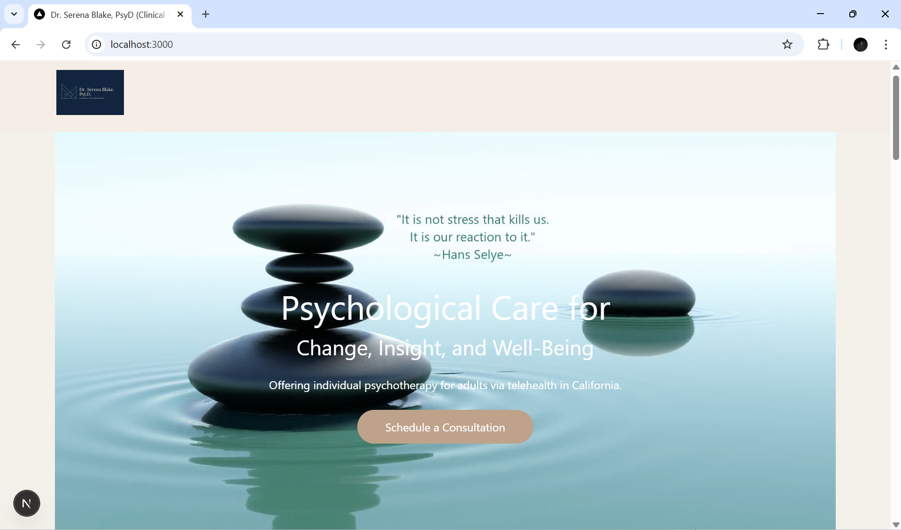
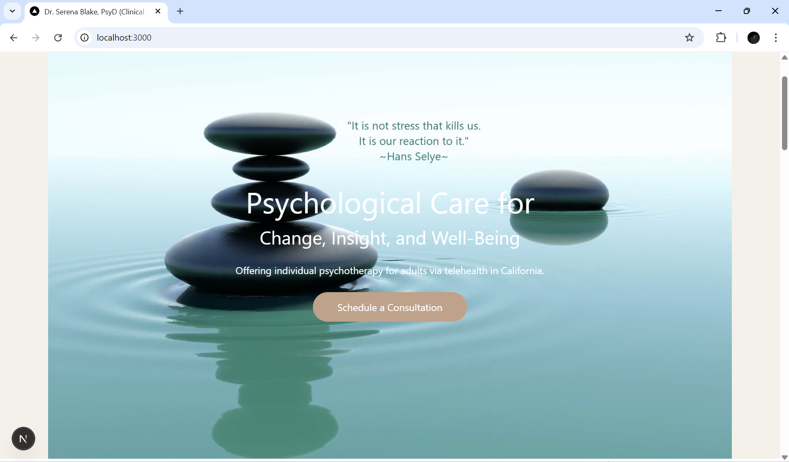
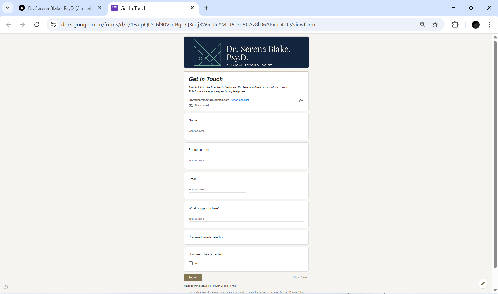
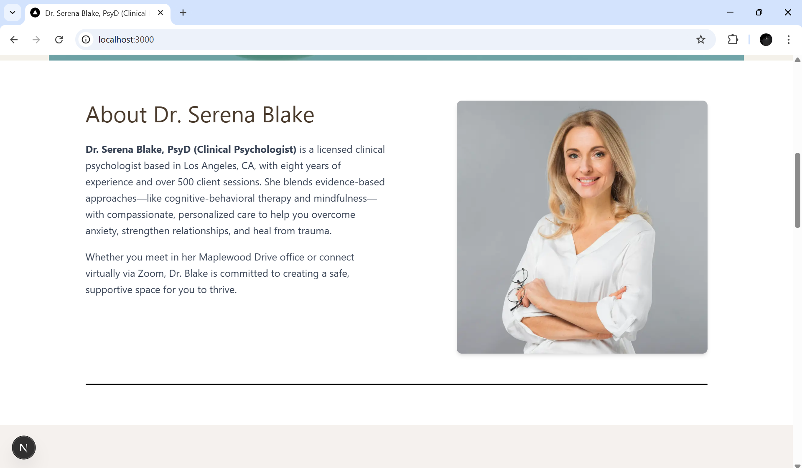
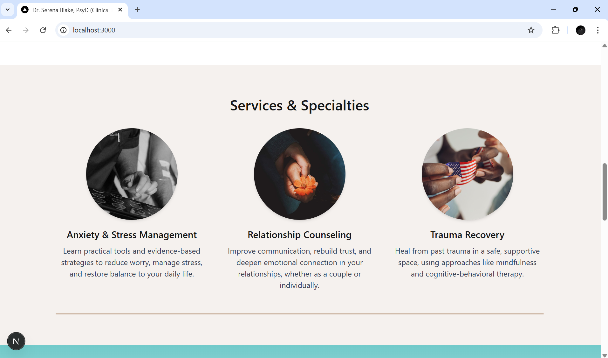
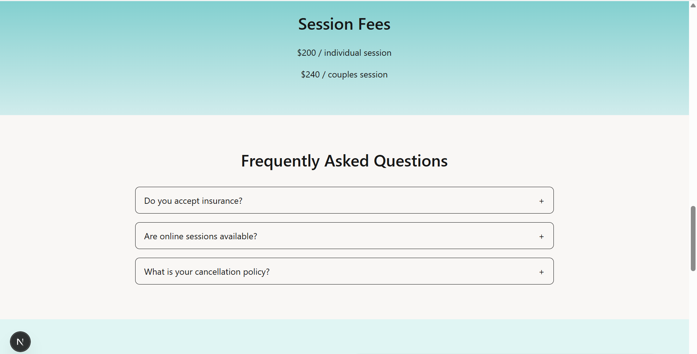
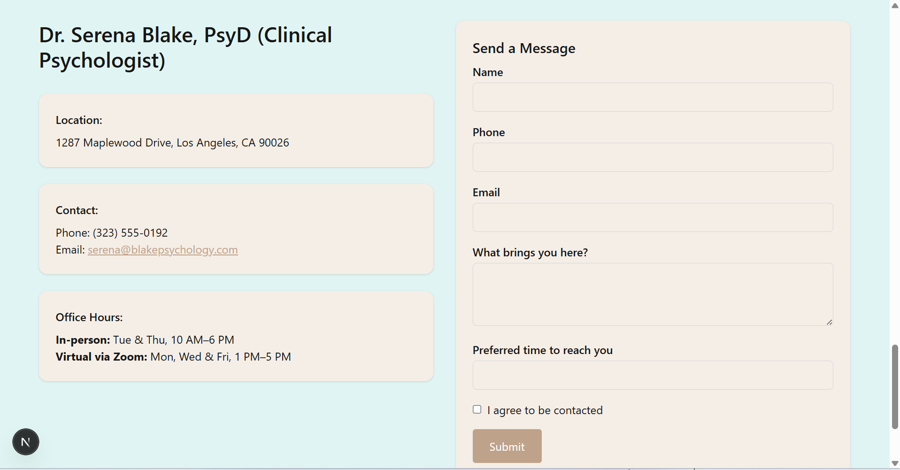
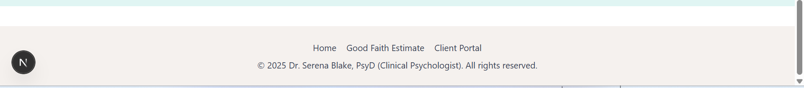
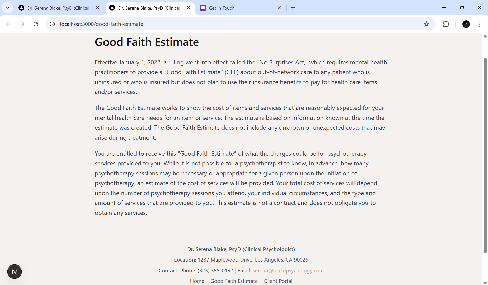
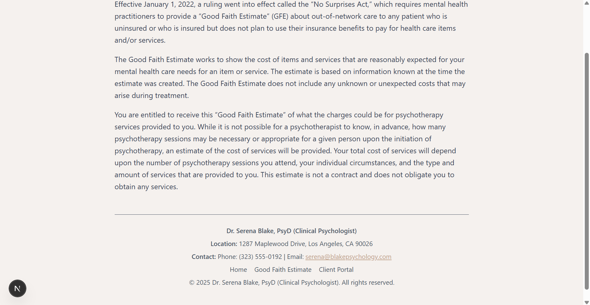

# 🧠 Dr. Serena Blake – Therapist Website

A clean, responsive, and accessible website for Dr. Serena Blake, PsyD (Clinical Psychologist) built with **Next.js 14**, **Tailwind CSS**, and **Framer Motion**.

> 📍 Live: [https://therapist-website.vercel.app](https://therapist-website.vercel.app)

---

## ✨ Features

* Full-screen hero section with background video and animated text
* About section with professional bio and image
* Services section highlighting specialties with images
* FAQ accordion (expand/collapse)
* Contact section with info cards and contact form (with inline validation)
* Smooth fade-in and scroll animations (Framer Motion)
* Fully responsive on desktop, tablet, and mobile


---

## 🗂️ Project Structure
            /app
            ├── components/
            │   ├── About.tsx
            │   ├── Contact.tsx
            │   ├── FAQ.tsx
            │   ├── Footer.tsx
            │   ├── Hero.tsx
            │   ├── Services.tsx
            │   ├── SessionFees.tsx
            │
            ├── good-faith-estimate/
            │   └── page.tsx
            │
            ├── favicon.ico
            ├── globals.css
            ├── layout.tsx
            └── page.tsx
            /public
            ├── images/
            └── videos/

---
## 📸 Preview of Sections & Components

### Logo  
  
  <br></br>

### User Interface 
 
  <br></br>
  
  <br></br>

### Schedule a Consultation

  <br></br>

### About

<br></br>

### Services & Specialties

<br></br>

### Session Fees &  FAQ

<br></br>

### Contact Form

<br></br>

### Reserved Rights

<br></br>

### Good Faith Estimate

<br></br>

<br></br>

## 🛠️ Built With
### Tech Stack
* [Next.js 14](https://nextjs.org/)
* [Tailwind CSS](https://tailwindcss.com/)
* [Framer Motion](https://www.framer.com/motion/) – for animations
* React (App Router)

---

## 📦 Installation & Local Development

Clone the repository and run locally:

```
git clone https://github.com/kavya-sharma22/therapist-website.git
cd therapist-website
npm install
npm run dev
```

Then open [http://localhost:3000](http://localhost:3000) to view the site.

---

## 🚀 Deployment

Easily deploy to [Vercel](https://vercel.com):

1. Push your code to GitHub.
2. Go to Vercel → **New Project** → import your repo.
3. Click **Deploy**.

Vercel handles builds, deployments, and gives you a live URL.

---

## 📄 License

This project is built for educational / portfolio purposes and is not intended for real-world production without further customization.

---

##  Credits

Designed & developed by **Kavya Sharma**
Inspired by the assignment from [growmytherapy.com](https://growmytherapy.com).

---

## ✏️ Contact

For questions or collaboration:
📧 [kavyasharmaa2205@gmail.com](mailto:kavyasharmaa2205@gmail.com)
